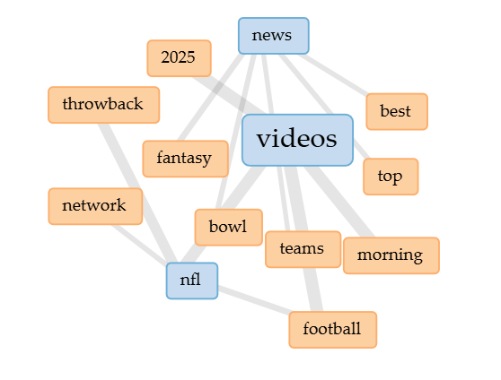



# Distant Reading Assignment 

I used Voyant and Copilot to search this website: [NFL Website](https://www.nfl.com/)

The results from both tools were vastly different for me, as a first time "distant reading" user. Voyant seemed very one dimensional and only gave me commonly used words, it doesn't tell me much about the actual topic. However, Copilot was very helpful and I would use it again, it answered any questions and summarized the text very well. Voyant can't tell us a lot of things compared to Copilot, and Copilot can also tell us what Voyant did so I don't see a reason to use Voyant over Copilot. Some things I asked Copilot were how my Minnesota Vikings were mentioned compared to other NFL teams and the results surprised me, I thought they would on the lower half but it turns out they were a top 10 mentioned team. It is cool to see what the most commonly used words on the website was in a graphic from Voyant, but Copilot gave me a graph of how much my Vikings were mentioned compared to other NFL teams without even asking for a graphic.

This file ends in ".md," which means it is a Markdown document, rather than HTML. I find Markdown easier to use than HTML, but you can easily change this to an HTML document if you prefer: just replace the .md with .html and commit! 

Here is a fun link to a [Markdown Cheatsheet](https://www.markdownguide.org/cheat-sheet/). Once you grasp the basics here, go add "Markdown" to your list of skills on your resume!
