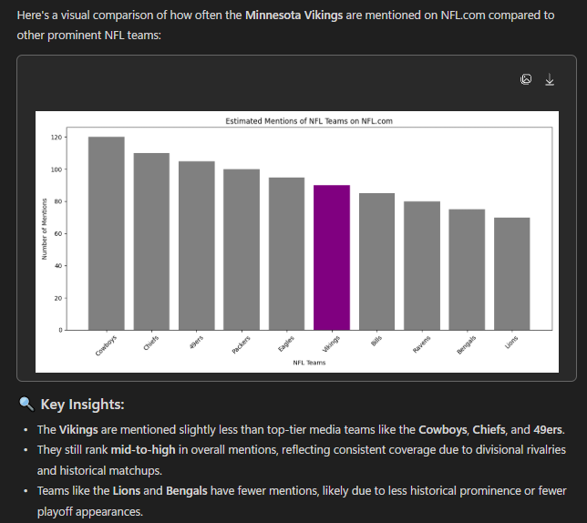



# Distant Reading Assignment 

I used Voyant and Copilot to search this website: [NFL Website](https://www.nfl.com/)

The results from both tools were vastly different for me, as a first time "distant reading" user. Voyant seemed very one dimensional and only gave me commonly used words, it doesn't tell me much about the actual topic. However, Copilot was very helpful and I would use it again, it answered any questions and summarized the text very well. I chose this site because the NFL season just started and I am a massive Vikings fan, so I asked around Copilot how the Vikings were mentioned/treated compared to the other NFL teams. While I expected the Vikings to be on the lower side of mentions and interactions, I was pleasantly surprised that they were actually top 10, just behind the large market teams and the teams that have been extremely successful in recent years. Copilot told me a ton of statistics, ones that I found interesting and some I would have absolutely no use for, but overall it was very cool to see what "distant reading" was like.

This file ends in ".md," which means it is a Markdown document, rather than HTML. I find Markdown easier to use than HTML, but you can easily change this to an HTML document if you prefer: just replace the .md with .html and commit! 

Here is a fun link to a [Markdown Cheatsheet](https://www.markdownguide.org/cheat-sheet/). Once you grasp the basics here, go add "Markdown" to your list of skills on your resume!
